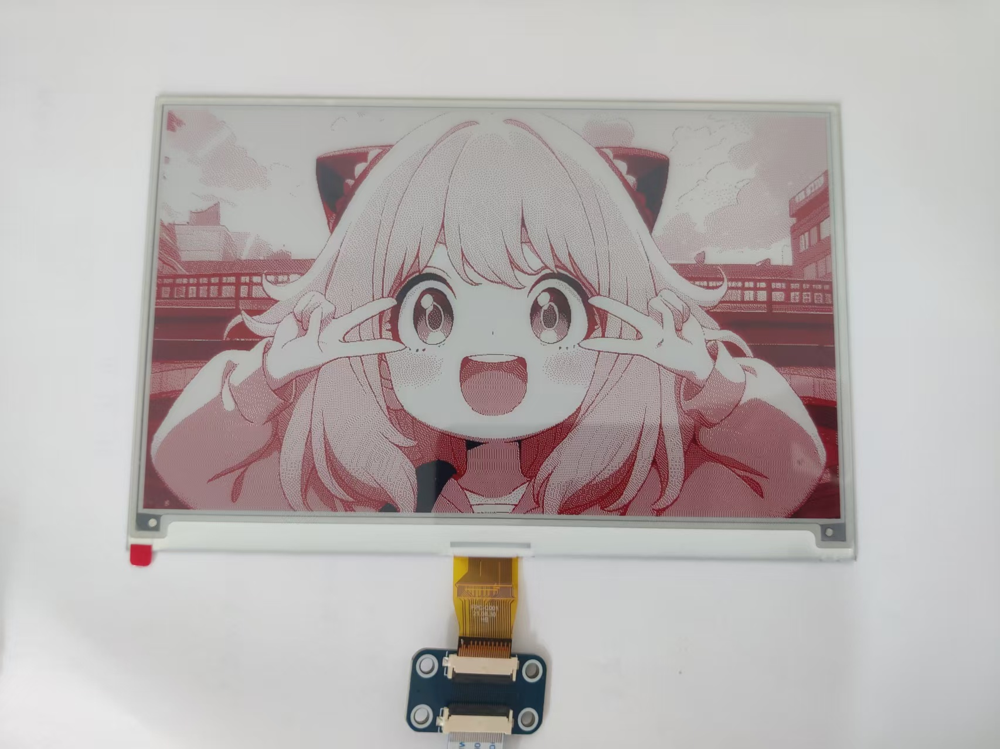
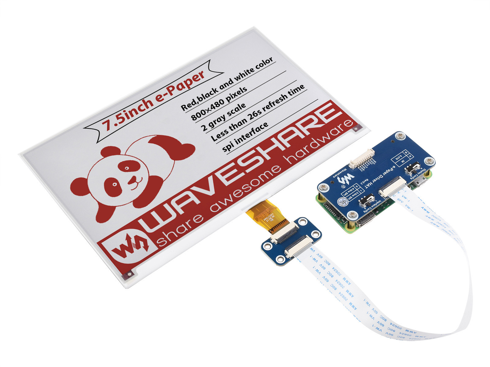

### 简介

- 微雪E-Paper ESP32 图片处理及图片上传程序的JAVA实现，替代HTML工具。可集成到其他项目，实现自动化屏幕更新。
- 实现了图片处理：色阶法和抖动法，原理见[微雪 E-Paper ESP32 Driver Board 教程及算法介绍](https://www.waveshare.net/wiki/E-Paper_ESP32_Driver_Board#WiFi.E4.BE.8B.E7.A8.8B)。
- 实现了图片上传（指令）：上传图片到ESP32，并通知ESP32进行图片显示。
- [EPaperImageUploader.java](src%2Fmain%2Fjava%2Fcom%2Fdkaishu%2Fesp32wf_java_uploader%2FEPaperImageUploader.java) 是上传功能的实现。
[EPaperImageProcessor.java](src%2Fmain%2Fjava%2Fcom%2Fdkaishu%2Fesp32wf_java_uploader%2FEPaperImageProcessor.java) 是图片处理功能的demo。
二者实现方式基本一致，但有区别，可自行修改。
 - 显示效果：

### 说明
- 使用时需修改 SERVER_URL 为自己的服务器地址。
- 示例代码在 main 方法中。
- **注意：** 因硬件限制，只测试了 7.5inch-e-Paper-HAT-B 屏，欢迎反馈其他型号的测试结果，欢迎提交 pull requests。

### 资料

[微雪 E-Paper ESP32 Driver Board 教程及算法介绍](https://www.waveshare.net/wiki/E-Paper_ESP32_Driver_Board#WiFi.E4.BE.8B.E7.A8.8B)

[微雪 示例屏幕及代码](https://www.waveshare.net/wiki/7.5inch_e-Paper_HAT_(B)_Manual#Arduino)

